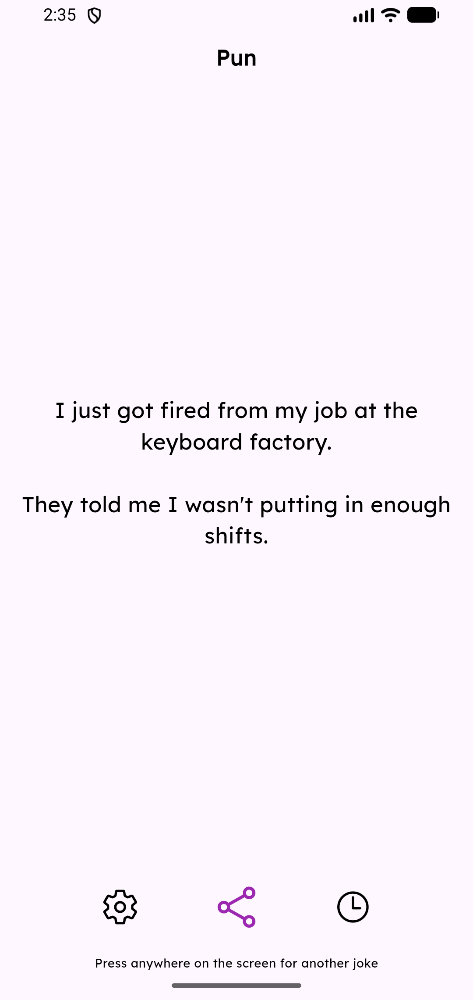
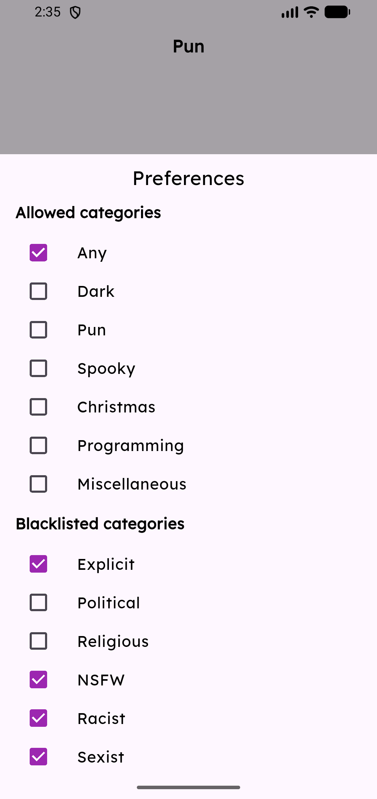
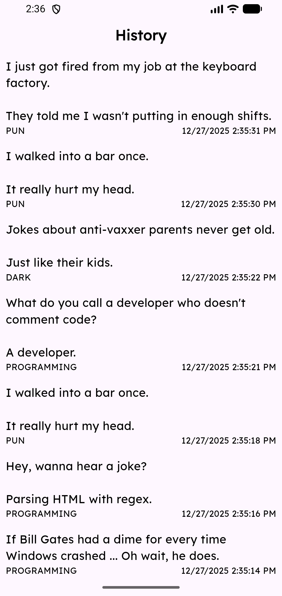

# gigglify_rp

### Gigglify
A jokes app made in [Flutter](https://flutter.dev), [riverpod](https://riverpod.dev/) using clean architecture. More info in the packages used section

You can set your preferred categories and blacklist some types of jokes. History can be viewed and shared.

## Libraries / Packages Used

- Get It : Dependency Injection
- Riverpod : State Management
- Auto Route : Routing
- Dio : REST Calls
- intl : Localization
- Flutter Secure Storage : Encrypted Shared Preferences
- Freezed : JSON Model Generation
- ObjectBox : Database storage for Joke History
- Google Fonts : Fonts
- Modal Bottom Sheet : For Preferences and History bottom sheets

## Architecture

- Clean Architecture was used. The code is split into three sections

1. `domain` - core entities `Joke` and `Choice`, their abstract `repositories` and `use cases`
2. `data` - access to the data sources - `api`, `database` and `preference` occurs here. Implementations of the domain
   layer repositories.
3. `presentation` - the user facing layer. Has screens, navigation, riverpod providers, localization and theming

- The clean architecture dependency declaration and injection is done in [di.dart](lib/di.dart)
  using [Get It](https://pub.dev/packages/get_it) (The service locator pattern)

## Data Flow
The data flows from the data source to the repository to the use case to the provider to the ui.

And vice versa
```
Data Source -> Repository -> Use Case -> Riverpod Provider -> UI Screens

Screen -> Riverpod Provider -> Use Case -> Repository -> Data Source
```

## Screenshots 

1. Home Screen - Shows a Joke and it's category and action buttons



2. Preferences Screen - Shows Allowed and Blacklisted Categories



3. History Screen - Shows a list of past jokes


## Getting Started

This project is a starting point for a Flutter application.

A few resources to get you started if this is your first Flutter project:

- [Lab: Write your first Flutter app](https://docs.flutter.dev/get-started/codelab)
- [Cookbook: Useful Flutter samples](https://docs.flutter.dev/cookbook)

For help getting started with Flutter development, view the
[online documentation](https://docs.flutter.dev/), which offers tutorials,
samples, guidance on mobile development, and a full API reference.
