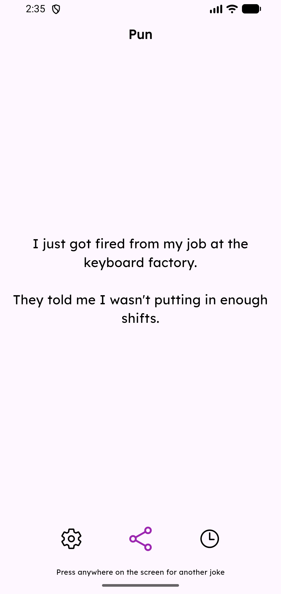
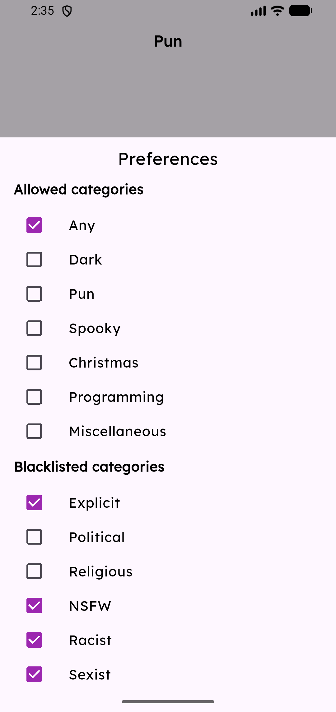
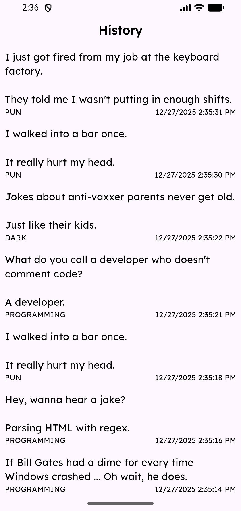

# gigglify_rp

### Gigglify
A jokes app made in [Flutter](https://flutter.dev), [riverpod](https://riverpod.dev/) using clean architecture. It now features **comprehensive dark mode support**, a **modern PageView navigation** for a seamless user experience, and **optimistic UI updates** for preferences.

You can set your preferred categories and blacklist some types of jokes. History can be viewed and shared. The app adapts to your system's theme or allows you to choose light or dark mode.

## Features & Highlights

-   **Dark Mode Support:** Fully adaptive UI with System, Light, and Dark theme options. User preferences are persisted.
-   **PageView Navigation:** Smooth, carousel-like navigation between the central Joke screen, Preferences (left swipe), and History (right swipe).
-   **Optimistic UI Updates:** Instant feedback when toggling joke categories and blacklist preferences, with background saving and error handling.
-   **Intuitive Back Navigation:** System back button intelligently navigates within the PageView before exiting the app.
-   **Joke Management:** Fetch random jokes, view history, set category preferences, and blacklist certain types of jokes.
-   **Sharing:** Easily share jokes with others.

## Libraries / Packages Used

-   **injectable / Get It:** Robust Dependency Injection for a scalable architecture.
-   **Riverpod:** Powerful State Management for reactive and maintainable UI.
-   **Auto Route:** Declarative routing for easy navigation.
-   **Dio:** HTTP client for REST API calls.
-   **intl:** Internationalization and localization support.
-   **Flutter Secure Storage:** Encrypted local storage for sensitive data and user preferences.
-   **Freezed:** Code generation for immutable data models.
-   **ObjectBox:** High-performance database storage for Joke History.
-   **Google Fonts:** Custom typography.
-   **smooth_page_indicator:** Visual indicator for PageView navigation.

## Architecture

-   **Clean Architecture** was used. The code is split into three sections:
    1.  `domain` - core entities (`Joke`, `Choice`), their abstract `repositories`, and `use cases`.
    2.  `data` - access to the data sources (`api`, `database`, `preference`) occurs here. Contains implementations of the domain layer repositories.
    3.  `presentation` - the user-facing layer. Has screens, navigation, Riverpod providers, localization, and theming.

-   The clean architecture dependency declaration and injection is done in [di.dart](lib/di.dart) using `injectable` and `Get It`.

## Data Flow
The data flows from the data source to the repository to the use case to the provider to the UI.

And vice versa:
```
Data Source -> Repository -> Use Case -> Riverpod Provider -> UI Screens

Screen -> Riverpod Provider -> Use Case -> Repository -> Data Source
```

## Screenshots 

**NOTE:** *Screenshots need to be updated to reflect the new PageView navigation and dark mode support.*

1. Home Screen - Shows a Joke and its category and action buttons



2. Preferences Screen - Shows Allowed and Blacklisted Categories



3. History Screen - Shows a list of past jokes


## Getting Started

This project is a starting point for a Flutter application.

A few resources to get you started if this is your first Flutter project:

-   [Lab: Write your first Flutter app](https://docs.flutter.dev/get-started/codelab)
-   [Cookbook: Useful Flutter samples](https://docs.flutter.dev/cookbook)

For help getting started with Flutter development, view the
[online documentation](https://docs.flutter.dev/), which offers tutorials,
samples, guidance on mobile development, and a full API reference.
